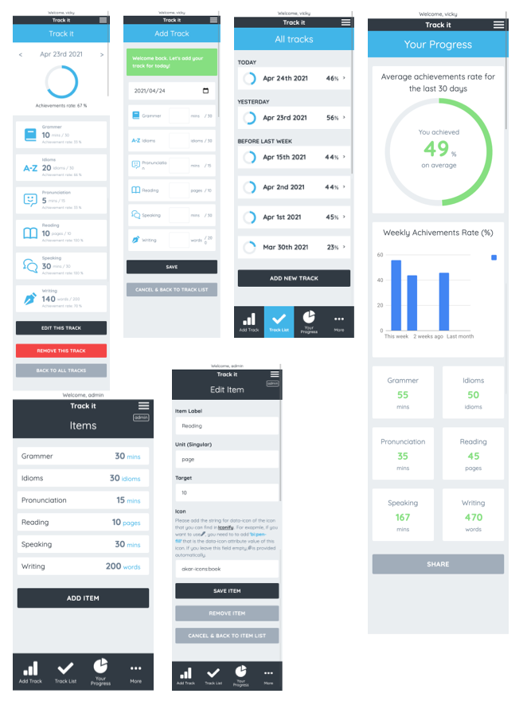

# Tracking App built with React

## About the Project
Experience seamless management of database resources through this responsive web application, crafted using React and Redux as the culminating project at Microverse. Complemented by a robust REST API developed with Ruby on Rails, this application empowers users to efficiently add, edit, and remove records tailored to their tracking needs. Whether monitoring daily progress in language acquisition or any other endeavor, the platform offers versatile functionality.

### Key Features

- Integration with the back-end API for seamless data transmission.
- Intuitive routing facilitates easy navigation between screens.
- Utilization of Redux for centralized storage of essential information, such as user credentials.
- Deployment on Heroku for convenient online access.
- Front-end to server user authentication implementation.
- Creating an admin panel enables item management operations like creation, updating, and deletion.
- Development of responsive layouts catering to both tablet and desktop interfaces, adhering to design standards.
- Incorporation of a progress page featuring dynamic data charts showcasing average achievement rates and total scores.

Please see the [REST API with Ruby on Rails](https://github.com/yocosaka/Tracking-App-Api-with-Rails) built as a backend for this project.

A list of commonly used resources that I find helpful is listed in the acknowledgments.

## Built With

* [React](https://reactjs.org/)
* [Redux](https://redux.js.org/)
* [JavaScript](https://en.wikipedia.org/wiki/JavaScript)
* [HTML5](https://en.wikipedia.org/wiki/HTML5)
* [SASS](https://sass-lang.com/)

## Live Demo

[Live Demo Link](https://yoco-tracking-app-front.herokuapp.com/)

## Getting Started

To get a local copy up and running follow these simple example steps.

1. On the project GitHub page, navigate to the main page of the repository.
2. Under the repository name, locate and click on a green button named `Code`. 
3. Copy the project URL as displayed.
4. If you're running the Windows Operating System, open your command prompt. On Linux, Open your terminal. 
5. Change the current working directory to the location where you want the cloned directory to be made. Leave as it is if the current location is where you want the project to be. 
6. Type git clone, and then paste the URL you copied in Step 3.  
e.g. $ git clone https://github.com/yourUsername/yourProjectName 
7. Press Enter. Your local copy will be created. 
8. Go to helpers/baseUrl.js and rewrite the baseUrl like `http://localhost:3001/` so you can run this project in your local environment
9. To run the server, run `npm start`
10. To run the tests, run `npm test`

## How to use this app as a user

1. To start using this app as a user, you need to log in with a username and password. This login is authenticated by API
2. Then, you can record your track for each item for each day: Idioms, Pronunciation, Reading, etc.
3. On the all tracks page, you can check the past tracks you've made
4. On the progress page, you can see your progress so far

## How to manage items as an admin user

1. Like the ordinary user, you need to log in with a username and password as an admin user, which is required to be given the status of admin: true by the administrator for the API
  * You can see how to create admin user in the [Readme file for the REST API](https://github.com/yocosaka/Tracking-App-Api-with-Rails)
2. Then, you'll see the admin page. On this page, the items that are added by administrators will show
3. By clicking the "Add item" button, it shows the form, and you can add an item
4. By clicking each item, you can edit it

## Author

👤 **Yoko Saka**

- GitHub: [@yocosaka](https://github.com/yocosaka)
- Twitter: [@yocosaka](https://twitter.com/yocosaka)
- LinkedIn: [Yoko Saka](https://www.linkedin.com/in/yokosaka)

## Contributing

Contributions, issues, and feature requests are welcome!
Feel free to check the [issues page](../../issues).

1. Fork the Project
2. Create your Feature Branch (`git checkout -b feature/AmazingFeature`)
3. Commit your Changes (`git commit -m 'Add some AmazingFeature'`)
4. Push to the Branch (`git push origin feature/AmazingFeature`)
5. Open a Pull Request

## Show your support

Give a ⭐️ if you like this project!

## License

### Design:
["Bodytrack.it "](https://www.behance.net/gallery/13271423/Bodytrackit-An-iOs-app-Branding-UX-and-UI) design idea by [Gregoire Vella](https://www.behance.net/gregoirevella) is licensed under [Creative Commons license of the design](https://creativecommons.org/licenses/by-nc/4.0/).

### Application:
This project is [MIT](./LICENSE) licensed except for the design above

## Acknowledgements
* [Proptypes](https://reactjs.org/docs/typechecking-with-proptypes.html)
* [Moment.js](https://momentjs.com/)
* [axios](https://github.com/axios/axios)
* [Pluralize](https://github.com/plurals/pluralize)
* [Google Fonts](https://fonts.google.com/)
* [Pixabay](https://pixabay.com/)
* [React Icons](https://react-icons.github.io/react-icons)
* [Iconify](https://iconify.design/icon-sets/)
