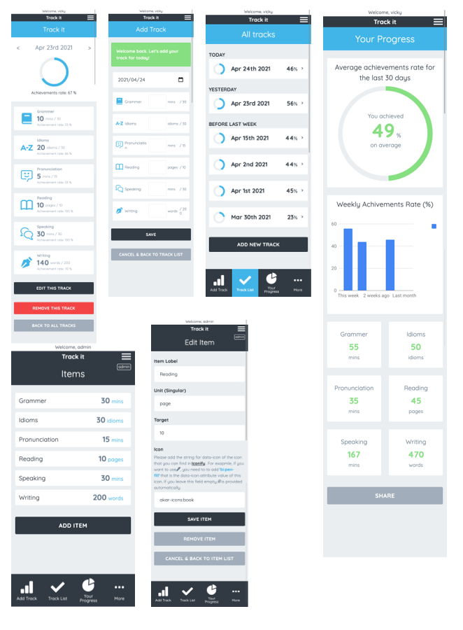

# 📦 Tracking App – A UX-Informed Daily Progress Tracker

A responsive, fullstack app for tracking learning habits — combining frontend clarity with backend structure, personalized data modeling, and UX-driven API design.



---

## 🧭 About the Project

**Tracking App** is a fullstack CRUD-based tracker designed for recording progress in customizable categories (e.g. pronunciation, idioms, reading).  
Developed as a capstone at Microverse, it blends **React + Redux** on the frontend with a **Rails REST API** backend.

### 🧠 UX Highlights
- Designed **intuitive user flow** from login → record → history → chart
- Minimized friction in data input with **clear feedback & minimalist UI**
- Incorporated **progress visualization** to motivate continued use
- Created **admin mode** with structured item management for flexibility
- Auth flow and state logic aligned to reduce user confusion and redundancy
- Mapped user interaction patterns to backend data structure and API responses, reducing cognitive load and redundant logic

This project reflects my focus on aligning data structure and user interaction — with clarity, simplicity, and real-world usability.

### 🔗 API & Data Modeling
- Designed and implemented a Rails REST API — defining endpoints, request structures, and response patterns aligned with frontend UX logic
- Created and normalized a PostgreSQL schema to support flexible, category-based habit tracking
- Used JWT authentication to secure user sessions, integrated with frontend state logic
- Mapped data relationships across users, items, and records to support maintainability, query efficiency, and intuitive UI behavior

### 🧭 Data Flow & Integration
- Connected the React + Redux frontend with the Rails API for full CRUD operations.
- Designed API endpoints and backend logic to directly reflect frontend flows and user intent
- Structured async data updates using Redux while preserving predictability and clear state transitions

---

## 🚀 Key Features

- 🔐 Google-like login experience (username/password via API)
- 📊 Track daily progress and visualize it through dynamic charts
- 🗂 View historical data by category
- ⚙️ Admin interface for CRUD item management
- 🔁 Fully responsive design (tablet & desktop)
- 🔗 UX-driven REST API and schema design with frontend–backend integration

Backend repo:  
🔗 [Tracking App API – Ruby on Rails](https://github.com/yocosaka/Tracking-App-Api-with-Rails)

---

## 🛠️ Built With

- Frontend: [React](https://reactjs.org/) / [Redux](https://redux.js.org/) / [SASS](https://sass-lang.com/)
- Backend: Ruby on Rails (REST API)  
- Auth: Frontend-auth flow via Redux & API logic  
- Visualization: Chart logic (vanilla + CSS)
  
---

## ⚙️ Getting Started

To run locally:

```bash
git clone https://github.com/yoko-vicky/Tracking-App-with-React-Redux
cd Tracking-App-with-React-Redux
npm install
npm start
```
To run the backend API, see [Tracking App API Repo](https://github.com/yoko-vicky/Tracking-App-Api-with-Rails)

---

## 👥 Usage

### As a User
1. Login with your credentials
2. Track your daily activities (Idioms, Reading, etc.)
3. View historical records and progress chart

### As an Admin
1. Login with an `admin: true` account (see API repo for setup)
2. Manage tracking categories (add / edit / delete items)

---

## 👤 Author

**Yoko Saka**  
Frontend Developer × UX Thinker

- GitHub: [yoko-vicky](https://github.com/yoko-vicky)
- LinkedIn: [Yoko Saka](https://www.linkedin.com/in/yoko-vicky/)
- Portfolio: [View My Work](https://www.yokoworks.dev/)
- 
---

## 🤝 Contributing

1. Fork the repo  
2. Create a feature branch (`git checkout -b feature/AmazingFeature`)  
3. Commit your changes (`git commit -m 'Add some AmazingFeature'`)  
4. Push to the branch (`git push origin feature/AmazingFeature`)  
5. Open a Pull Request

---

## ⭐️ Support

Give a ⭐️ if this helped or inspired you!

---

## 📝 License

**Application:** MIT License  
**Design Inspiration:**  
["Bodytrack.it"](https://www.behance.net/gallery/13271423/Bodytrackit-An-iOs-app-Branding-UX-and-UI) by [Gregoire Vella](https://www.behance.net/gregoirevella)  
Licensed under [CC BY-NC 4.0](https://creativecommons.org/licenses/by-nc/4.0/)

---

## 🙏 Acknowledgements

- [Redux](https://redux.js.org/)
- [Moment.js](https://momentjs.com/)
- [axios](https://github.com/axios/axios)
- [Pluralize](https://github.com/plurals/pluralize)
- [Google Fonts](https://fonts.google.com/)
- [Pixabay](https://pixabay.com/)
- [React Icons](https://react-icons.github.io/react-icons)
- [Iconify](https://iconify.design/icon-sets/)

